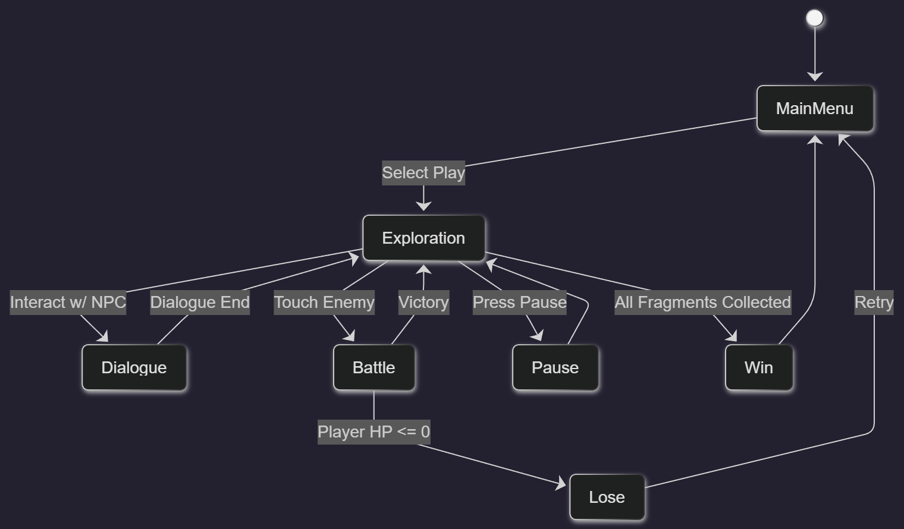
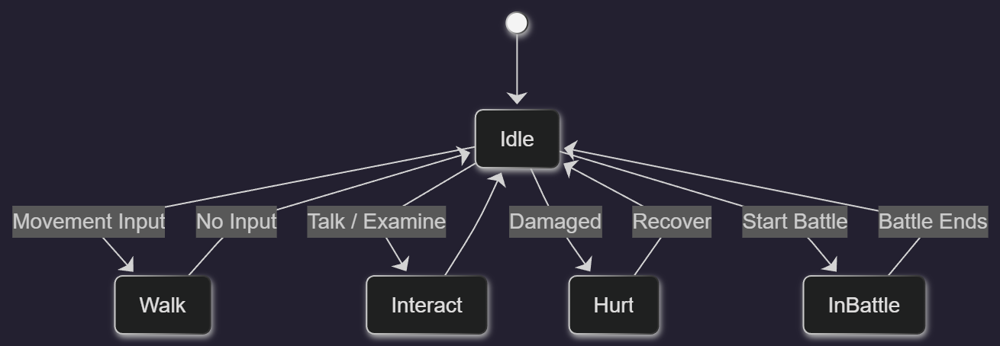
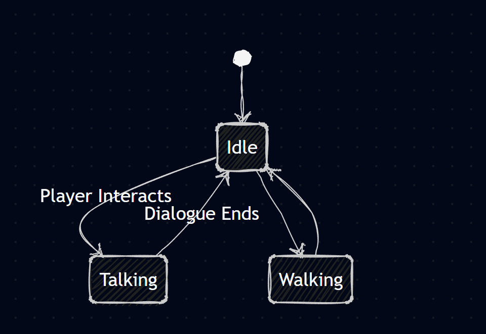
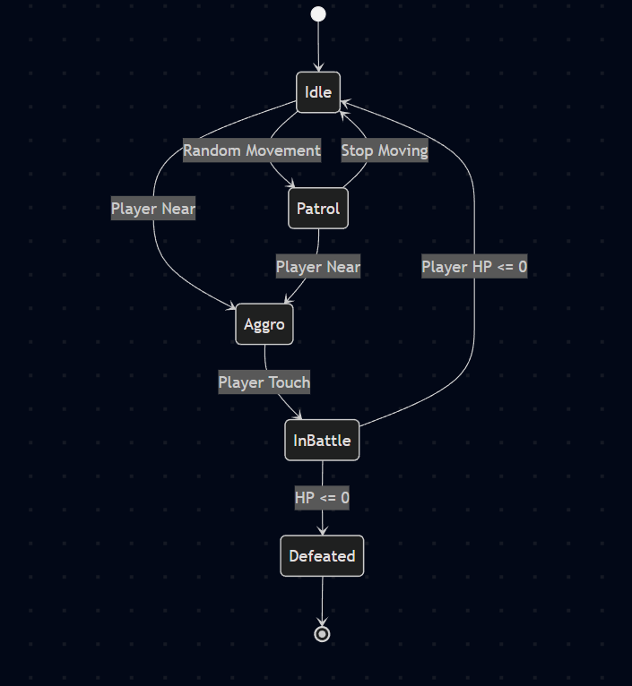
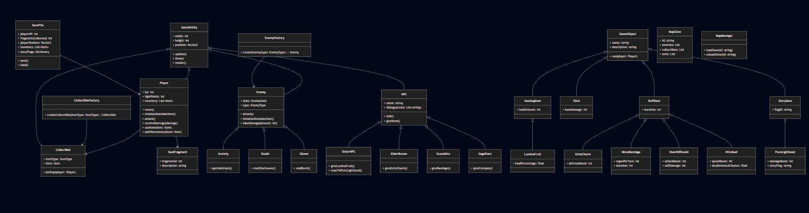
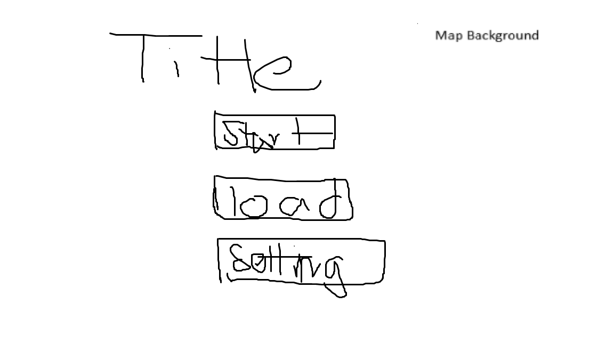
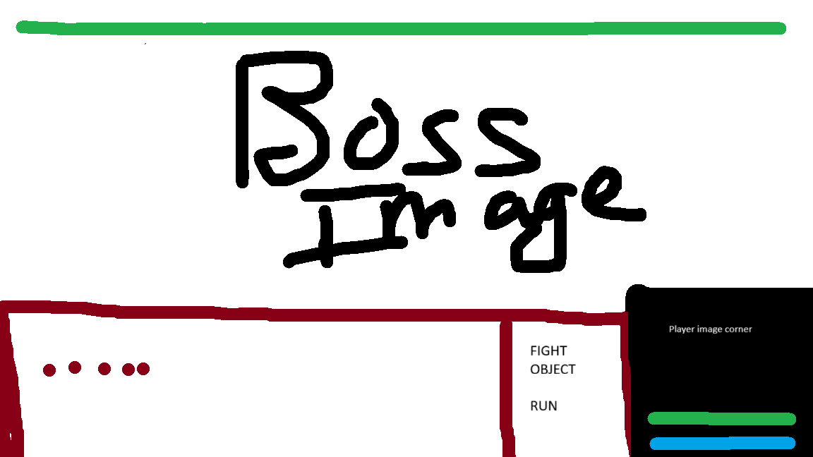

# Final Project

- [ ] Read the [project requirements](https://vikramsinghmtl.github.io/420-5P6-Game-Programming/project/requirements).
- [ ] Replace the sample proposal below with the one for your game idea.
- [ ] Get the proposal greenlit by Vik.
- [ ] Place any assets in `assets/` and remember to update `src/config.json`.
- [ ] Decide on a height and width inside `src/globals.js`. The height and width will most likely be determined based on the size of the assets you find.
- [ ] Start building the individual components of your game, constantly referring to the proposal you wrote to keep yourself on track.
- [ ] Good luck, you got this!

---

# Sample Proposal - Fragments of Lumina

## ✒️ Description

Fragments of Lumina is a narrative-driven 2D adventure game where the player awakens in a blank void with only a floating light named Lumie as their guide. The player soon discovers that they have lost their memories - including the memory of their sister, who becomes the first main NPC and the player's save point. The world has been shattered into three Soul Fragments, each protected by corrupted guardians. To restore the world — and the player’s identity — players must explore the map, uncover secrets, fight monsters and bosses, and make choices that can save or doom key characters.

## 🕹️ Gameplay

Game Start:
Player awakens in a blank void with Lumie (a flying light companion).
After the intro conversation, screen fades to black -> player wakes up in a new world with the sister Npc

Core Gameplay loop:

1.  Explore the semi-open world map
2.  Battle enemies using turn-based combat
3.  Collect items, keys, and lore
4.  Talk to NPCs to unlock quests
5.  Find Soul Fragments
6.  Fight bosses guarding the fragments
7.  Return fragments to the Lumina Shrine
8.  Unlock new areas
9.  Reach the final confrontation

Movement: Arrow Keys

- Interact / Talk: E
- Open Inventory: I
- Pause Menu: Esc
- Confirm: Enter
- Cancel: Backspace

Quest Structure
Fragment 1 — The Lost Beast

- Player explores the forest
- Fragment 1 is hidden in a monster’s lair in a corner of the map
- The sister hints at it but doesn’t force a quest lock
- Beat the Beast of Sound (Boss 1, Doubt)
- Obtain Fragment 1

Fragment 2 — The Door of Echoes
NPC requirements:

- Talk to Elder Rowan
- Talk to Scout Mira
- Find the Echo Key
- Open the sealed ruin door
- Fight mid-level enemies inside
- Find Fragment 2

Returning to sister:

- Sister is gone
- New NPC says that she was taken
- This unlocks the arena area
- Must fight Corrupted Guardian (Boss 2, Anxiety)

SPECIAL SAVE PATH:
If the player performs a hidden action earlier ( collecting the Pure Light Seeds before Fragment 2 and bringing it back to the sister), the sister does not get taken and the player skips Boss 2.

Fragment 3 — The Heart of Lumina

- Meet NPC Sage Elara, who guides you to the Shattered Peak
- Final boss: The Hollow Self (Gloom)
- Win -> obtain the final fragment

Endgame & Ending
After assembling all three fragments:

- Player regains memories
- Return to his original world

Objects:

1. Lumina Fruit
   Type: Healing item
   Who gives it: The sister NPC

- Gameplay Effect:
  Heals 25–35% HP
  Very limited, boosts early survivability

2. Echo Charm
   Type: Temporary defense boost (2 turn damage reduction)
   Given by: Elder Rowan during Fragment 2’s quest

3. Mira's Scout Bandage
   Type: Small healing over time (regenerates small HP each turn)
   Given by: Scout Mira (Fragment 2 questline NPC)

- Gameplay Use:
  Regenerates 5 HP per turn for 3 turns

4. Pure Light Seed
   Type: Key story item or Combat buff
   Found: Hidden early

- Gameplay Effect:
  Can only be used against Anxiety (second boss).
  Will block Anxiety healing power helping the player win.
- Story Effect
  If returned to the sister → she is saved, and Boss 2 is skipped

5. Stick
   Type: Weapon
   Found: On the ground randomly

- Gameplay Effect:
  Use to attack enemy without using a turn.

6. Shard of Doubt
   Type: Increase attack for one turn but hurt the player
   Found: Beast of Sound minions drop

7. Windleaf
   Type: Combat speed boost, increase the chance of double attack in one turn
   Found: On the ground

## 📃 Requirements

The system shall:

1. Allow the player to start a new game or continue from save
2. Load player state and object collected
3. Spawn the player in correct scene (void → world)
4. Display Lumie intro dialogue
5. Unlock areas based on fragments obtained
6. Track which NPCs the player has spoken to
7. Track whether the sister is saved or captured
8. Handle player inventory (keys, fragments, items)
9. Maintain state machines for:
   - Global game flow
   - Enemy AI
   - Boss phases
   - NPC behaviors
10. Load map zones dynamically
11. Trigger events when entering certain areas
12. Start boss fights when entering arenas
13. Award fragments after bosses
14. Update quest log
15. Trigger alternate path if “Save Sister” conditions met
16. Manage ending sequences based on choices

### 🤖 State Diagram

### 🗺️ Class Diagram

### 🧵 Wireframes

> [!note]
> Your wireframes don't have to be super polished. They can even be black/white and hand drawn. I'm just looking for a rough idea about what you're visualizing.

- Start will create a new game
- Load will load the save file if it exist.
- Setting is where the user can change the music sound and more.

The fighting screen title is very clear. The combat system is just like pokemon and omori.

When the user clicks on I in the open world, a textbox appears with Stat and Items. Depending on the user choice it will display the specific information.

### 🎨 Assets

I used paint to create the wireframes. Wireframes are the equivalent to the skeleton of a web app since they are used to describe the functionality of the product and the users experience.

I plan on following trends already found in other indies game such as omori and pokemon. I plan on having a soft fantasy vide and keep the story and combat simple.

## 🎨 Map Sprite Credits

Source: Szadiart, Rogue Fantasy Catacombs, Itch.io
Link: https://szadiart.itch.io/rogue-fantasy-catacombs

Used For: Caves, monster lairs, arena zone and Fragment 2 ruin interior.
Why:
This tileset provides darker, atmospheric dungeon and cave tiles that complement the mood of boss fights (Anxiety).

Source: Penzilla, Top-Down Retro Interior, Itch.io
Link: https://penzilla.itch.io/top-down-retro-interior

Used For: House interior, cozy NPC rooms.

Source: Snowhex, Pixel Plains, Itch.io
Link: https://snowhex.itch.io/pixel-plains

Used For: Calm grassland areas, early safe zones.
Why:
This set complements the main overworld with softer, pastel outdoor tiles. Great for emotional contrast before the world becomes more dangerous.

## 🎨 Character Sprite Credits

- Erisesra — Character Templates Pack  
  https://erisesra.itch.io/character-templates-pack  
  Used for NPCs: Sister, Elder Rowan, Scout Mira, Sage Elara.

- Creativekind — Nightborne Warrior  
  https://creativekind.itch.io/nightborne-warrior  
  Used for boss character sprite.

#### 🖼️ Images

The monster and character will all come from either [Itch.io](https://itch.io/game-assets) or custom made using libre sprite.

#### ✏️ Fonts

- Title: Tiny5 (https://fonts.google.com/specimen/Tiny5?categoryFilters=Appearance:%2FTheme%2FPixel)
- Dialogue/UI: Simple sans-serif like Roboto

#### 🔊 Sounds

Taken from freesound.org or original:
Bell chime (saving) (https://freesound.org/people/Fenodyrie/sounds/583947/)

Sword slashes
(https://freesound.org/people/ethanchase7744/sounds/441666/)
(https://freesound.org/people/wesleyextreme_gamer/sounds/574820/)

Boss roars
(https://freesound.org/people/ShangASDFGuy123/sounds/706571/)
(https://freesound.org/people/Ovkovko/sounds/825469/)

Ambient soundscapes -
(https://freesound.org/people/SoundsCoolio/sounds/814873/)
(https://freesound.org/people/felix.blume/sounds/671340/)
(https://freesound.org/people/Seth_Makes_Sounds/sounds/670039/)
(https://freesound.org/people/Ulrich_Wehner/sounds/639976/)

### 📚 References

- Game inspiring the style

* Omori
* Hollow knight
* Zelda
